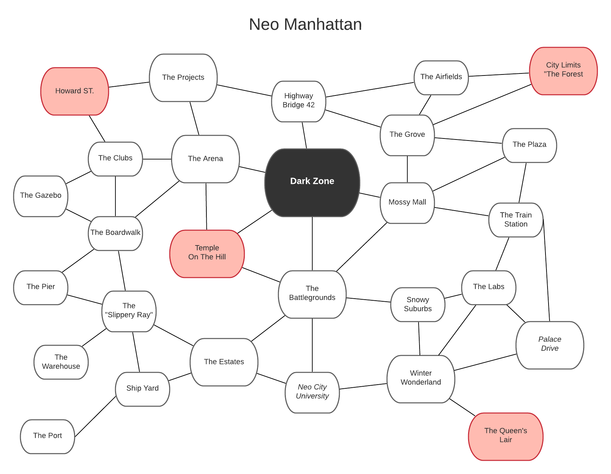

Neo-Manhattan
======

I will be honest, I only chose Manhattan because that is where Vinny, the character giving this story, is from. This city could technically be called anything. It does not have to be from North America. In any case, the place must be highly metropolitan. This means the place has skyscrapers, strip malls, garages, highways, freeways, bridges, and warehouses. The city itself was meant to hold about 5 Million people (if not more). This should be considered when mapping out the city yourself. Otherwise I may post a few pictures of my envisioned city down below.

# Lore of Neo-Manhattan
A lot has (and is going to) happen(ed) in Neo-Manhattan. Consider the apocalypse is happening, but over the course of several years. It began as fake stars started appearing in the sky (inspired by the anime plot from *Darker than Black*). These stars prefaced the rise of special abilities in individuals. Wars would break out in secret. Governments and Organizations would try to hold together. However, [two destined individuals would meet](https://open.spotify.com/track/2sFUNO7GTx5VbKRwPhbEmF?si=GFoOKhlDSwubtiZKZJjxpA). Occurring at the center of the town, this would leave a permanent mark in the center of the metropolitan area. The stain will last until the apocalypse ends, leaving nothing but smithereens to this once great city. 

***

This campaign specifically takes place a couple months after this legendary fight. It occurs before these "avatars" finish their fight. Since this fight, Neo-Manhattan has become slightly barren but still lively. People have started dividing themselves amongst several communities bordering the black hole like structure in the center of the city. This means the city is more barren as you get closer to the black hole. The outskirts may contain large groups of people, yet to evacuate from the destruction.

# The Communities
Each community has a particular reason for sticking around. Whether criminal or otherwise, many have considered this city to be their home for a very long time. They are not leaving for some apocalypse. There are also those that believe this city to hold the ability to become all powerful. Listed below are some examples of communities within Neo-Manhattan

### The Mob
The *Dockside Mobsters* are the most friendly community in the city. While they own most of the legal business and organized crime, they choose to survive through capitalism rather than power. Some in the mob believe power, provided through special abilities, does not truly represent the respect a leader needs. Most of the sane residents of Neo-Manhattan live under the protection of the *Dockside Mobsters*. They work within this community. They try to procure a meaningful and conservative life from what they have. The players should start within this community.

### Howard Street and the Night District
North of the docks but still by the waterfront, the Night District is the "undercity" of Neo-Manhattan. The residents, followers of anarchy and chaos, frequent the nightclubs and streets of this district. Many chaotic evils live within this community. One cannot sleep a night here without being bombarded by thieving scum. The *Dockside Mobster* have thwarted many invading efforts at their bar, the "Slippery Ray." A certain extremist group resides under the rule of a certain evil leader. This leader controls his minions, spreading fear and death in their wake. The leader does not control everyone in the district, but many theorize his headquarter lies somewhere on *Howard Street*. 

#### The Arena
The Night District thrives on the notion "Kill or Be Killed." Hence, the Arena was created. The Arena funnels right off the __Dark Zone__, forcing many to believe gifted individuals have the most power there. It is here that low-lives can gain notoriety. There is somewhat of a secret organization here as well: a Fight Club. It is highly secretive, but if a hero impresses the right people, then they could make it in.

### Ice Queen's Lair
The Ice Queen used to be the legendary HOA president of her suburban utopia. A pleasure to join in a party or book club. As the fake stars started gaining visibility, the president started to change. Acquiring the ability to use powers, the *sovereign* quickly grew crazy with power, creating an entire domain of snow barring any possible threats from the outside. Many statues have been strewn throughout the once pleasant neighbors. Recent travellers report seeing them move. The Ice Queen is very dangerous and should be avoided if possible. It is to great benefit that she has stayed secluded for most of the cataclysm.

### The Temple On The Hill
Fog replaced this once lively eclectic temple. Made up of [Torii](https://en.wikipedia.org/wiki/Torii) and different varieties of colorful buildings, the *Temple On The Hill* has now become a very haunting place. No one visits the temple. Those that have gone do not return. Cries of a depressing and lonely sadness are the only things heard from [The Battlegrounds](#the-battlegrounds) nearby.

### The Awakeners Grove
The area surrounding "The Grove" represents Awakeners Colony. *The Awakener* is a passive player in this disastrous apocalypse. The Awakener and their followers are relatively peaceful. Many have called them "hippies" and "tree-huggers" to their apparent apathy. Many call for conspiracy that *The Awakener* has bigger plans. It is also known *The Awakener* has commanded plants to do their bidding. With this hidden cult like colony (similar to elven cultures in fantasy) many have a hard time tracking them down. The area they hold however, has never held more wildlife in a metropolitan area. So if an adventurer can find *The Awakener*, it would be best for them to make a valuable ally.

# The Amazing Sights!
There are also a few important places created from the initial battles of the apocalypse.

### The Battlegrounds
Strewn with swords and weapons from a legendary war between righteous and rebellion, The Battlegrounds are now a setting for looters and thieves. Old soldiers comb the place for gun running and weapons trading. How illegal can it be with a displaced out government as it is? Most of these individuals are just lost, poor, and guilty warriors, looking for a reason to fight again. Most travellers are forced to roam this land at some point in their journey. Rivaling communities often meet here like the two original armies that died here. Nothing as big as the war in conjunction with the creation of the __Dark Zone__.

### Neo City University
The city's university (apart from the many missing students) has changed very little since the apocalypse. Remaining so close to [The Battlgrounds](#the-battlegrounds) and the __Dark Zone__, few students will return. Many of the *Dockside Mobsters* will hold gatherings and meetings their in celebration. Otherwise it remains a pretty neutral zone. Most tourists use it for safe travels. However, it remains only a detour from the crossroads in nearby [Battlegrounds](#the-battlegrounds).

# Pictures of the City

#### A Diagram of the Area

This represents the freedom of travelling for the player characters. The lines represent available streetways to and from the destination. Red areas are known to house the most powerful beings, often secluding themselves. The __Dark Zone__ is also listed.